# GAN Image Colorization with Controlled Parameters

Based off of [github.com/ImagingLab/Colorizing-with-GANs](https://github.com/ImagingLab/Colorizing-with-GANs)

## Task

Given a grayscale (b&w) image and a set of parameters as the input, automatically generate a colorized image respecting these parameters as the output.

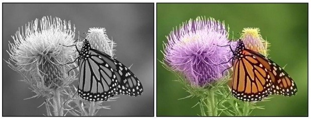

[Zhang, Isola, Efros]

## Color Space

For the colorization process, the $Lab$ color space is used; One of the channels ($L$) is the input, and this also prevents sudden jumps in both color and brightness, unlike RGB.

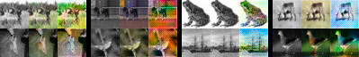

## Model

### Generator

Symmetric with skip connections, the encoder part consisting of $4 \times 4$ convolution layers with stride $2$, each followed by batch normalization and LeakyReLU with slope $0.2$; the decoder part consisting of $4 \times 4$ transposed convolution layers with stride $2$, concatenation with the activation map of its encoder mirrored layer, followed by batch normalization and ReLU; the last layer is a $1 \times 1$ convolution with $\tanh$ activation function.


### Discriminator

Formed by a series of $4 \times 4$ convolutional layers with stride $2$, batch normalization, and LeakyReLU with slope $0.2$. After the last layer, a convolution is applied to map a $1$ dimensional output, followed by a sigmoid function in order to return a probability value of the input's veracity.


### Changes for Better Performance

 - Adam optimization;
 - Weight initialization as proposed by [He, Kaiming et al.];
 - Initial learning rate of $2 \cdot 10^{-4}$ for both the generator and the discriminator;
 - Decay the learning rate by a factor of $10$ when the loss function starts to plateau;
 - L1-Norm in the generator's loss function ($\lambda \left\lVert G\left( 0_z \mid x \right) - y \right\rVert_1$) with $\lambda = 100$;
 - Heuristic cost function proposed by [Goodfellow, Nips 2016 tutorial];
 - One sided label smoothing;
 - Batch normalization;
 - Strided convolutions instead of spatial pooling;
 - Reduced momentum;
 - LeakyReLU instead of ReLU;

### Cost Functions

The cost functions defined by [Nazeri, Kamyar and Ng, Eric and Ebrahimi, Mehran] are as follows:

$$\underset{\theta_G}{\min} J^{\left(G\right)} \left(\theta_D, \theta_G\right) = \underset{\theta_G}{\min} -\mathbb{E}_z \left[ \log \left( D \left( 0_z \mid x \right) \right) \right] + \lambda \left\lVert G\left( 0_z \mid x \right) - y \right\rVert_1$$

$$\underset{\theta_D}{\max} J^{\left(D\right)} \left(\theta_D, \theta_G\right) = \underset{\theta_D}{\max} \left( \mathbb{E}_y\left[ \log \left(D\left(y \mid x\right)\right) \right] + \mathbb{E}_z\left[ \log \left( 1 - D\left(G\left( 0_z \mid x \right) \mid x \right) \right) \right] \right)$$

In order to introduce controls over parameters, new terms are introduced as follows:

$$\cdots + \lambda_S \left\lvert \overline{G\left( 0_z \mid x \right)_S} - \sigma_S \right\rvert$$
$$\cdots + \lambda_H \left\lvert \overline{G\left( 0_z \mid x \right)_H} - \sigma_H \right\rvert$$
$$\cdots + \lambda_R \left\lvert \overline{G\left( 0_z \mid x \right)_R} - \sigma_R \right\rvert$$
$$\cdots + \lambda_G \left\lvert \overline{G\left( 0_z \mid x \right)_G} - \sigma_G \right\rvert$$
$$\cdots + \lambda_B \left\lvert \overline{G\left( 0_z \mid x \right)_B} - \sigma_B \right\rvert$$
$$\vdots$$

## Environment Setup

 * Google Colab
    - Tesla K80 GPU
    - 12 hours of usage before timeout
    - Ability to run multiple instances at once (max. 10);
    - Quirkiness;
 * Tensorflow

## Training

To train the model under the CIFAR-10 dataset, use the following command:

```
python train.py \
    --seed 100 \
    --dataset cifar10 \
    --dataset-path ./dataset/cifar10 \
    --checkpoints-path ./checkpoints \
    --batch-size 128 \
    --epochs 200 \
    --lr 3e-4 \
    --lr-decay-steps 1e4 \
    --augment True
```

and add other flags at the end, such as `--desired-saturation 1`, `--saturation-weight 20`, `--desired-hue 0.6`, etc.

## Results

 - Trained using CIFAR-10 dataset; Places365 was too large to fit Colab's storage and even when reduced did not train even one epoch before timeout;
 - Time to train the model with different parameters changed a lot; training with approx. 200 epochs takes aroudn 6 days;

### Previous Results

From [Nazeri, Kaymar and Ng, Eric and Ebrahimi, Mehran]

Grayscale / Original / U-Net / GAN

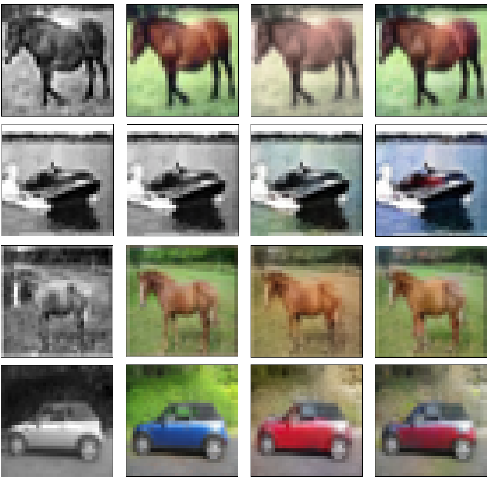

### $\sigma_S = 1$

(70000 steps = 179 epochs)

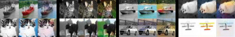

### $\sigma_S = 0.75$

(83000 steps = 212 epochs)

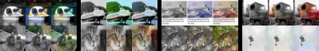

### $\sigma_S = 0.5$

(82000 steps = 209 epochs)

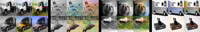

### $\sigma_S = 0.25$

(85000 steps = 217 epochs)

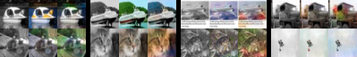

### $\sigma_S = 0$

(81000 steps = 207 epochs)

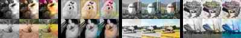

### $\sigma_H = 0$

(78000 steps = 199 epochs)

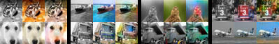

### $\sigma_H = 0.25$

(78000 steps = 199 epochs)

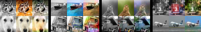

### $\sigma_H = 0.6$

(78000 steps = 199 epochs)

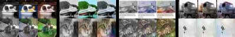

### $\sigma_H = 0.85$

(78000 steps = 199 epochs)

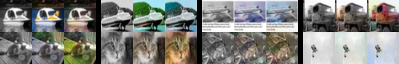

### $\sigma_S = 0.75, \sigma_H = 0.6$

(73000 steps = 186 epochs)

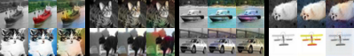

## Further Work

 - Experiment further with the added loss function terms (on the discriminator, on the generator, on both, etc.)
 - Experiment with adding weights to the added terms on the loss function (the results were generated with $\lambda_\ast = 1$);
 - Change the L1-Norm in the generator's loss function, so that it also considers the parameters;
 - Change the dataset or only a few of its images to fit the given parameters;
 - Train the network on other datasets (CelebA, CIFAR-100, Places365, LSUN, etc.);
